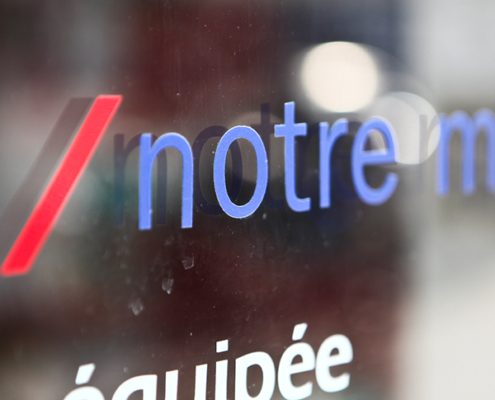

<b id="toc">Table of Content</b>

- [Introduction](#introduction)
	- [Purpose](#purpose)
	- [Scope](#scope)
- [Company Overview](#company-overview)
	- [Brand History & Facts](#brand-history--facts)
	- [Brand Values & Perceived Image](#brand-values--perceived-image)
	- [Product Ranges](#product-ranges)
	- [Benchmark](#benchmark)
	- [Brand Positioning](#brand-positioning)
- [User/Product Research](#userproduct-research)
	- [Provisional Research](#provisional-research)
	- [User Interviews](#user-interviews)
	- [Friction to Insights](#friction-to-insights)
	- [Context (law, energy, environment, etc.)](#context-law-energy-environment-etc)
- [Conclusion](#conclusion)

## Introduction
### Purpose
The purpose of the Business Analysis Document (BAD) is to present the stakeholders to our perception of the company's (SignAll) motives, needs and identity. This document has been produced thanks to the exchanges with the SignAll staff and an interview we conducted at their headquarters, featuring key executive members and some field technicians.

This document will try to show the stakeholders, the user research made in order to extract the problems, that will later be redefined as functional requirements. (in the next document)

### Scope
This document will include a prior analysis of the SignAll, to define their needs and will then proceed to enunciating clearly the user research, and the insights that came out of it.

This document will not proceed to explain how we take action to solve the said problems

## Company Overview
### Brand History & Facts
SignAll is an iconic brand located in the center of France, Vierzon, where it has known many successes and equipped many shops and institutions all around France since its creation in 1962, when they were still named APIA.

After fluctuations in the signing industry/market, SignAll was acquired in 2015 by Shango (Pierre Bastid's Investment fund) and since then, showed ambition to both pioneer new technologies but also grow over Europe in this slowly evolving market.

SignAll is an historic landmark of the city of Vierzon, working for a wide variety of customers such as insurance companies, banks, food industries etc.

### Brand Values & Perceived Image
<ins>Certifications & Labels</ins>

SignAll is proud to manufacture most of its components and materials in France in its factory and and holds few certifications which place them as a socially and environmentally responsible company and testifies of their will to progress and adapt in a fast-paced changing world.
- 
- 
- 
- 
- 

<ins>Motto:</ins>
_"Regarder toujours plus loin, c'est notre ADN. Cela se traduit par l'innovation, la conquête et la pérennité"_

### Product Ranges
SignAll creates a wide range of products, all of which can be either electrified or not.
- <ins>Sign:</ins>
	
- <ins>Flag</ins>
	
- <ins>Crest</ins>
	
- <ins>Display Panel</ins>
	
- <ins>Banner</ins>
	
- <ins>Totem</ins>
	
- <ins>Dynamic Display</ins>
	
- <ins>Window Stickers/Adhesive</ins>
	

It seems important to note that SignAll also offers <ins>maintenance services</ins>:

Maintenance on the signs may be:
- Preventive (planned visits):
	- Recurring check
	- Cleaning
	- Verification
	- Alerting
	- Reparations
- Curative (when a product is malfunctioning):
	- In case a product failure is noticed

### Benchmark
The signage market in France is relatively uncluttered and offers room for actors like SignAll to gain substantially more market shares through the strategy they have already identified: <ins>Innovation</ins>.

Indeed, the signage market has not seen many innovations since the advent of LEDs and there is definitely room for improvement that SignAll can leverage.

Essentially, the market is composed of many small actors, whose turnover are around 5M and few big actors that can be either direct or indirect competitors, French or European (Spanish or German for the biggest).

Even if SignAll wishes to expand beyond French borders on the mid to long term, we will focus on the sole French market for our study.
Therefore, the top five competitors would be:
- Visotec (Nantes), the true leader of signage market.
- Rousseau (Offranville), the biggest turnover, however a slightly different field, not a direct competitor
- Merim (Chateauroux), the closest competitor geographically speaking. They are specialized in dynamic & interactive displays.
- Semios (Rheu), the most direct competitor, specialized in hospitality, retail and textile industry

It is also interesting to note that both Visotec and Rousseau have already started to sell their products abroad, to European customers.

### Brand Positioning
[[draws/2022-10-27-00-14-40.excalidraw]]

## User/Product Research
### Provisional Research
In order to start the project, we have received basic guidelines from our director, Franck Jeannin.

We were told that SignAll required a way to control and monitor their products remotely.

We knew that the solution would need to feature a way to connect, without internet connection on site, and that LoRaWAN technologies were a good match for this purpose as they are reliable and resilient and require almost no adaptation on site.

We understood that such a solution would enable SignAll, overtime, to decrease the displacement required by the technicians do go from a curative/preventive maintenance to a predictive one, which SignAll would be the first on the market to offer.

From this knowledge, we started to imagine a solution that could be appended to existing signs but most certainly to new signs.

This motivated us to create personas, to put ourself in the shoes of the End User/ Customer/ Stakeholder and develop our ideation process further.

Those prior assumptions made us come up with many interrogations on  SignAll's exact needs so we planned an interview to dig deeper into the solution that would eventually be developped.

### User Interviews
During the interview we learned about many crucial aspects that would need to be incorporated in the solution in order to properly address the user/business requirements.

Climate Consciousness and RSE goals push all brands/shop owners and sign industries to meet new legal standards.

Nowadays, light pollution is more and more considered, so it is rather a question of brand image, than it is of energy consumption, since LEDs don't consume much energy

AppSolu must have financial interests in mind, therefore it must provide SignAll with real differentiation arguments and potentially have room for expandability in the future.
Each customer needs to set their lights according to their specific demands:
- Some lights need to be bounded to others to prevent for instance, individual letters from failing and deteriorating brand image.
- Therefore if one light fails, turn off the others.
	- However in this case, depending on the shop's configuration, if a shop features two façades, for instance, and one façade is failing, the remaining one must remain on, therefore some advanced coupling must be implemented to take care of this scenario.
- It must also be customizable since the context is evolving rapidly (laws & regulations, energy prices, technology, etc.)

SignAll works mainly for large streamlined customers, therefore retrofitting and hardware customization should not be a problem.

The solution must fit in one small protective case put on the exterior of the building, near the main sign. (putting the solution inside of products is optional but good to have)

90+% of products are 12v LEDs

SignAll wants to offer their customers the possibility to remotely control and monitor their products, and want to be the first one's to deploy this feature on the Market.

SignAll wants the ability to sell the solution to companies whom haven't bought their products (yet), acting as a "trojan horse"
- Thanks to "predictive maintenance", alerting their customers of an upcoming failure to entice them to acquire SignAll's products and services as replacement

SignAll suggested that adaptive dimming to ambient light might be a good idea

SignAll confirmed that sensing motion to detect traffic flow in order to adapt brightness could be a good idea but warned that:
- A sign cannot legally blink, so a certain delay would be mandatory before sign turning off/dimming.
	- The threshold for blinking is not legally set, but SignAll noted that if it turns on and off every 30 minutes, that wouldn't be a problem at all

The goal is for SignAll and their customers to use those "green features" as selling points in their strategies.

SignAll would ideally like an interface to monitor all the devices they have plugged with their associated data (if permitted by the client)

Ideally the solution would be a data entry point for physical shops.
- A company, [Yaki](https://yaki.com/fr/) is already doing that but sells every function separately in different devices.
	- SignAll would like to do the same overtime, but with a unique device, hence the name "AppSolu"
		- Such a solution could monitor traffic, temperature, pedestrian traffic in the shop and this data would allow to solve more problems and generate more revenues
		- Another idea  they had was to integrate the software for theft detectors, usually at the entrance of shops inside the device.
		- Their goal is to basically replace as many in-situ technologies as they possible.

SignAll emphasized that a big plus would be the predictive maintenance capabilities offered by such a device. That would cut on a lot of interventions and open for new business logics and revenues.

SignAll would like to target new segments and acquire new customers.

Ideally, the software infrastructure should be centralized at SignAll's headquarters to help with the maintenance.

### Friction to Insights
We can conclude from the user interview that:
SignAll's Customers need to be able to access an interface to control and monitor their products
- This is represented by Business/User requirement n°1

The solution must be able to plug to multiple LEDs, as having one device per LED is out of question.
- This is represented by Business/User requirement n°2

Grouping LEDs together are an absolute necessity since it lays the basis to on site customization
- This is represented by Business/User requirement n°2

Detecting LED failures is a necessity to both predictive maintenance and to avoid brand image detrioration
- This is represented by Business/User requirement n°3

Expandability is a huge plus, since the context evolves quickly and the solution must be resilient to change
- This is represented by Business/User requirement n°4

For all the aforementioned reasons, the customer must be able to set the brightness either automatically, manually or according to a schedule.
- This is represented by Business/User requirement n°5

SignAll's customers must be able to remotely set an activation schedule for their product, to adapt to energy, environmental or legal constraints anytime they may appear.
- This is represented by Business/User requirement n°6

### Context (law, energy, environment, etc.)
We would like to add that the current context is not favorable towards electric signs, since they embody apparent electric consumption. Indeed, SignAll indicated that light sources are almost considered as light pollution as time goes by. Therefore, all the brands and actors using signage technology must consider the public perception issues they could cause if not handled properly, and we took this matter into deep consideration since its impact on brands and users are disproportionately strong, compared to their actual power consumption, to say the least.

## Conclusion
Meeting SignAll's executives allowed us to understand their business needs and the frictions from their technicians or customers and really come up with specific use cases to address, which will eventually lead us to the functions required to solve those problems.

We have understood that SignAll was more interested in business opportunities and research matter, rather than fully a functional product, that could eventually take more time to research and develop, but decided to focus on a V0 project that will answer essential business logic questions and will later focus on how we will develop the rest of the feature, after validating our relationship with SignAll.