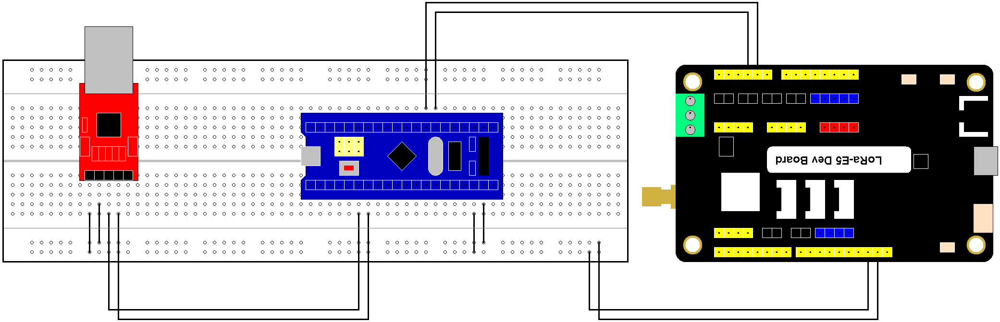
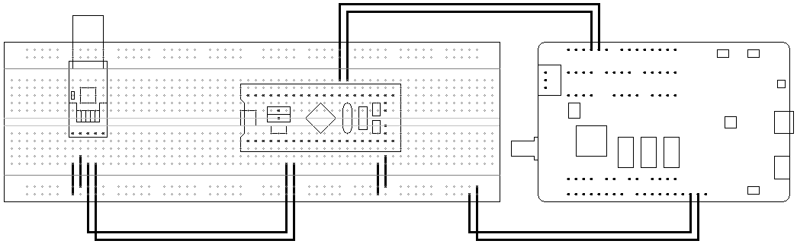
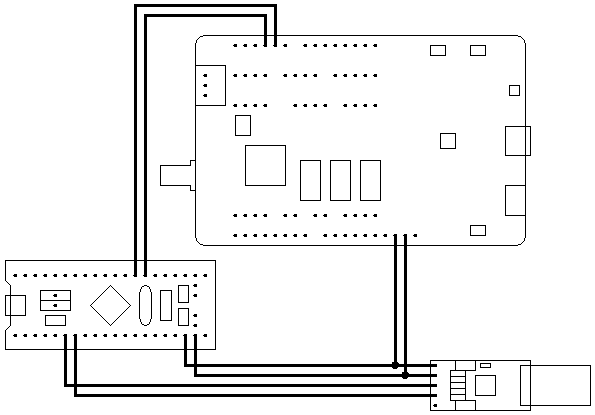
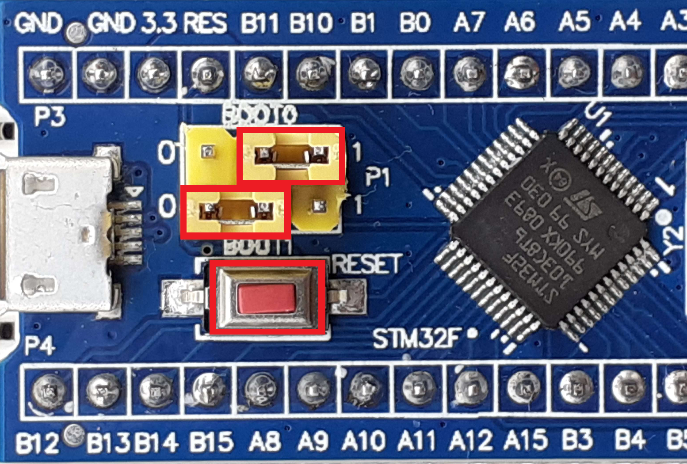
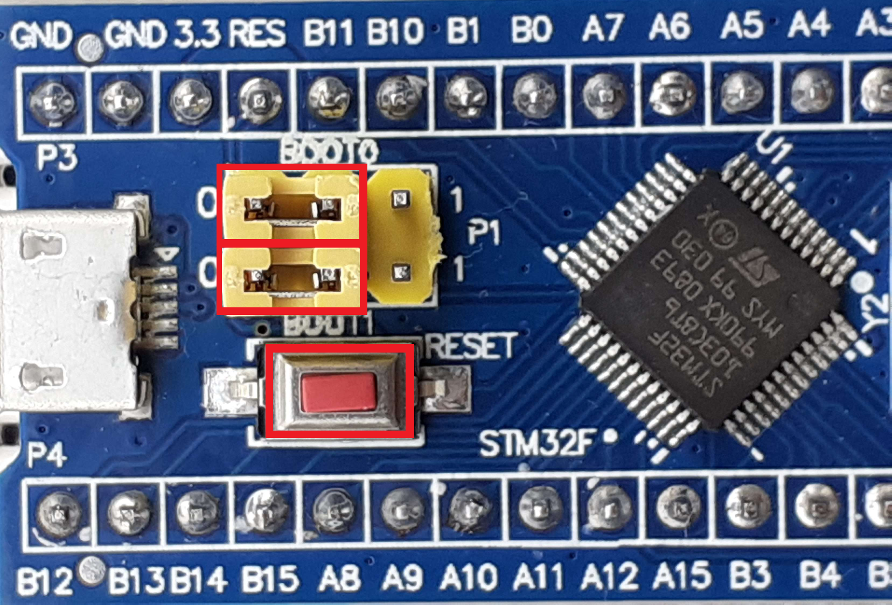

# Hardware

## Requirements
For this project, the following hardware is required:
- [LoRa E5 Dev Kit (STM32WLE5JC)](https://wiki.seeedstudio.com/LoRa_E5_Dev_Board/)
- [Bluepill (STM32F103C8T6)](https://stm32-base.org/boards/STM32F103C8T6-Blue-Pill.html)
- [USB to UART (CP2102)](https://microcontrollerslab.com/cp2102-uart-module-pinout-and-use-it-to-program-arduino-pro-mini/)

## Building

The components are wired in this manner:

<!-- TODO: Component wiring image -->

The connections from the computer to the LoRa board will be done this way:

If you do not have a breadboard you can simply do it like this:

# Required Softwares

The software is written in GO.
The compilation will be done with [TinyGo](https://tinygo.org/) and [OpenOCD](https://openocd.org/).
The flashing of the microchip will be done with [stm32flash](https://sourceforge.net/p/stm32flash/wiki/Home/)

## Software installation

- [TinyGo](https://tinygo.org/getting-started/install/)
- OpenOCD:
  - [Manually](https://sourceforge.net/projects/openocd/files/latest/download)
  - Via homebrew: `brew install open-ocd`
- [stm32flash](https://sourceforge.net/projects/stm32flash/files/latest/download)

Optional:
- [Arduino](https://www.arduino.cc/en/software)

## Arduino board

If you wish to use the Arduino IDE to monitor serial connections, you will have to follow these steps to be able to connect to the software.
1. Launch the Arduino IDE
2. Open the settings
3. In the "Additional board manager URLs", copy-paste this link `https://raw.githubusercontent.com/stm32duino/BoardManagerFiles/main/package_stmicroelectronics_index.json`
4. Open the board manager in `Tools > Board > Boards Manager...`
5. Search for `STM32 MCU base boards` and install
6. Once installed, select `Tools > Board > STM32 MCU base boards > Generic STM32F1 series`
7. Select `Tools > Board part number > BluePill F103C6 (32K)`
8. Select `Tools > Upload method > STM32CubeProgrammer (Serial)`
9. You can now use the serial monitor.

# Building and flashing

Automatically

The automated script for Windows has yet to be done. Please follow the manual instructions.

On the Bluepill chip, set the `BOOT0` jumper to 1 and make sure the `BOOT1` is on 0.

Copy the `flash.sh` file from the root folder to your project folder. Run it from a command prompt in this directory.

Manually

`BINARY_PATH` is the path of the final binary file. Must be a `.bin` file (`Documents/flash.bin` for example).
`MODULE_PATH` is the name you gave your go module when using `go mod init` (`example/flash` for example).

#### Building

In the root of your project directory, execute this command:
`tinygo build -target bluepill -o OUTPUT_PATH MODULE_PATH`

#### Flashing

On the Bluepill chip, set the `BOOT0` jumper to 1 and make sure the `BOOT1` is on 0.

If your device is connected to a serial monitor, disconnect it.

Get the port to your device. This can be done on Unix devices by running `ls /dev/tty.usb*`.

Run the flash command: `stm32flash -w build.bin -v PORT`. `PORT` is the port of the device you got above.

# Usage

If necessary, open a serial interface (such as the Arduino IDE) and connect it to the board.

Put the `BOOT0` jumper back to 0.
Start the program by pressing the `RESET` button on the board.
