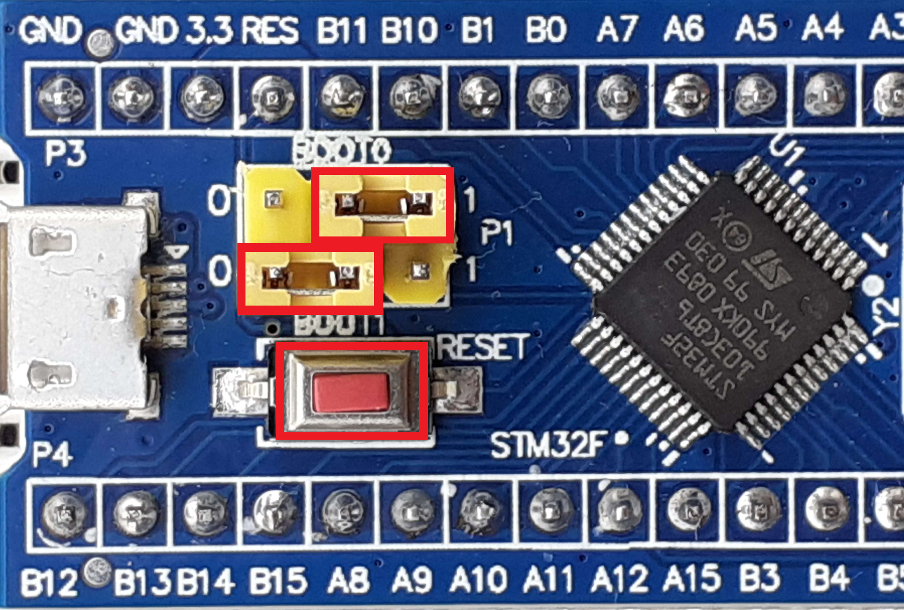
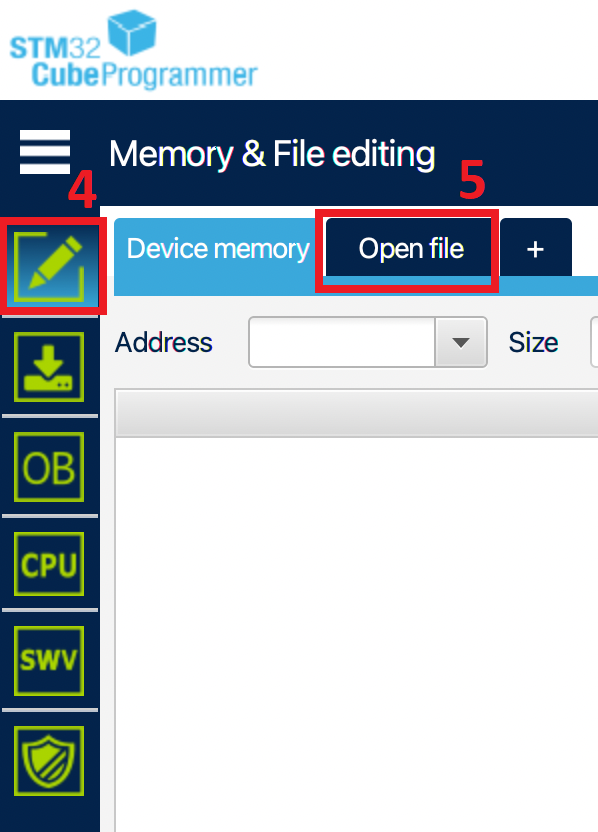
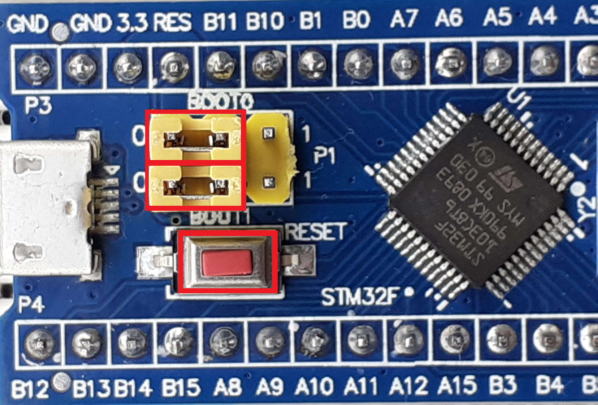

# Hardware

## Requirements
For this project, the following hardware is required:
<!--TODO-->

## Building

The components are wired in this manner:

<!-- TODO: Component wiring image -->

The connections from the computer to the LoRa board will be done this way:

<!-- TODO: Board wiring image -->

# Software

The software is written in GO.
The compilation will be done with [TinyGo](https://tinygo.org/) and [OpenOCD](https://openocd.org/).
The flashing of the microchip will be done with [SMT32CubeProgrammer](https://www.st.com/en/development-tools/stm32cubeprog.html)

## Software installation

[TinyGo](https://tinygo.org/getting-started/install/)
OpenOCD:
- [Manually](https://sourceforge.net/projects/openocd/files/latest/download)
- Via homebrew: `brew install open-ocd`
[STM32CubeProgrammer](https://www.st.com/en/development-tools/stm32cubeprog.html#get-software)

## Building and flashing

`BINARY_PATH` is the path of the final binary file. Must be a `.bin` file.
`MODULE_PATH` is the name you gave your go module with `go mod init`

#### Building

In the root of your project directory, execute this command:
`tinygo build -target bluepill -o OUTPUT_PATH MODULE_PATH`

#### Flashing

On the Bluepill chip, set the `BOOT0` jumper to 1 and make sure the `BOOT1` is on 0.

Open STM32CubeProgrammer.
Select the correct port and connect to the device in UART mode.
In the "Memory & File editing" tab, select "Open file".
Locate and open the binary file generated earlier at `BINARY_PATH`.
Click the "Download" button.
Finally, disconnect from the device.
<!-- TODO: Edit SMT32 screengrabs to show the buttons to click -->

#### Usage

If necessary, open a serial interface and connect it to the board.

Put the `BOOT0` jumper back to 0.
Start the program by pressing the `RESET` button on the board.
